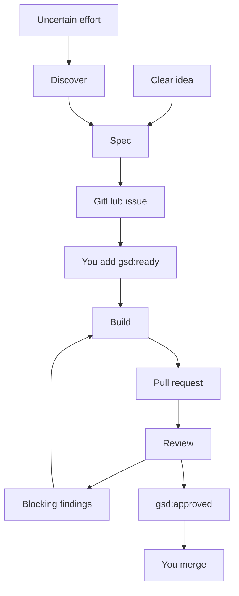

GSD Loop is a GitHub work queue for coding agents. You define and approve the
work. Agents build pull requests and review them against the approved issue.
You decide when to merge.

<Columns cols={2}>
  <Card title="Start your first issue" icon="play" href="/loop/quickstart">
    Install the skills, prepare your repository, and run a build and review.
  </Card>
  <Card title="Understand the workflow" icon="route" href="/loop/workflow">
    Learn the stages, issue contracts, labels, and human decisions.
  </Card>
  <Card title="Find your commands" icon="terminal" href="/loop/skills">
    Use the skills in Codex, Claude Code, Cursor, Gemini CLI, Grok Build, or Kimi Code.
  </Card>
  <Card title="Keep a lane running" icon="clock" href="/loop/scheduling">
    Schedule separate build and review passes in a supported host.
  </Card>
</Columns>

## How work moves

Discovery is optional. Use it when decisions must be resolved before you can
write a clear issue. Build and review each handle one unit of work per pass.

## Your responsibilities

- Read every queue issue and add `gsd:ready` only when you approve its scope.
- Answer `gsd:blocked` questions and remove the label when resolved.
- Resolve `gsd:escalated` items before returning them to automation.
- Review the PR evidence and merge when satisfied.

GSD Loop never merges, enables auto-merge, or force-pushes. `gsd:approved`
records review evidence; it does not replace your merge decision.

The [source repository](https://github.com/open-gsd/gsd-spec-build-loop)
contains the playbooks, installer, and deterministic helpers.
