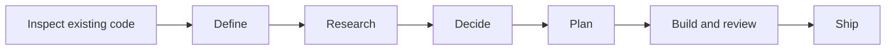

GSD Path is a project pipeline for AI coding agents. You approve the scope and
plan. Agents research, implement, and review the work. Each handoff is saved in
your repository's `.project/` directory, so a new session can resume from files.

<Columns cols={2}>
  <Card title="Install and start" icon="play" href="/path/quickstart">
    Install skills, add project rules, and start your first milestone.
  </Card>
  <Card title="Understand the workflow" icon="route" href="/path/workflow">
    See what each phase produces and where you make decisions.
  </Card>
  <Card title="Resume a project" icon="rotate-right" href="/path/recovery">
    Continue from saved state or diagnose a blocked pipeline.
  </Card>
  <Card title="Choose your host" icon="terminal" href="/path/reference/hosts">
    Find install flags and invocation syntax for your coding agent.
  </Card>
</Columns>

## How a milestone moves



Existing projects start with inspection. New projects start with definition.
A small, settled change may use the quick lane. Larger programs add a roadmap
and repeat the milestone cycle. See [lanes and gates](/path/workflow) and
[multi-milestone programs](/path/programs).

## Start with the router

Invoke `gsd-path` explicitly in your agent. The `path` alias runs the same router.
It reads saved state and chooses the next valid phase.

<Tabs>
  <Tab title="Codex">
    ```text
    $gsd-path
    ```
  </Tab>
  <Tab title="Slash-command hosts">
    ```text
    /gsd-path
    ```
  </Tab>
</Tabs>

<Note>
  A plain prompt such as “continue the project” reports the current handoff
  when Path owns the project state. It does not advance a phase. Use the
  explicit router or the named phase skill to continue.
</Note>

The [skill reference](/path/reference/skills) lists phase commands and tools for
discussion, documentation audits, migration, diagnosis, and undo.
